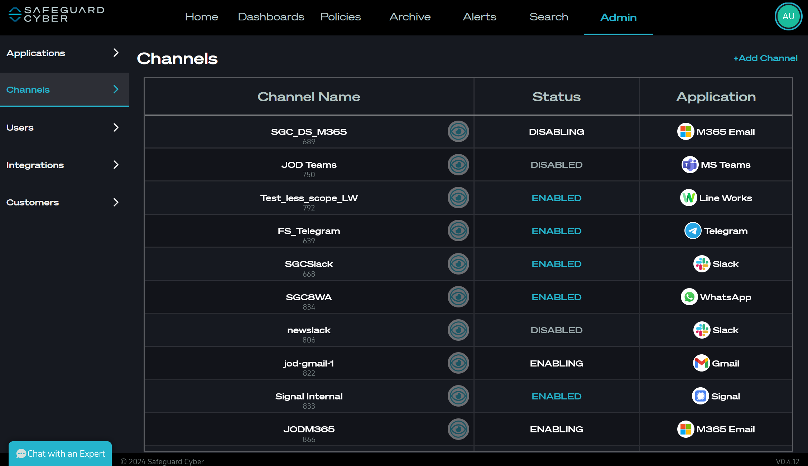
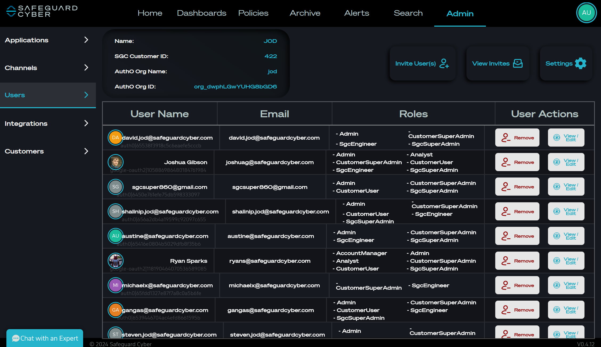
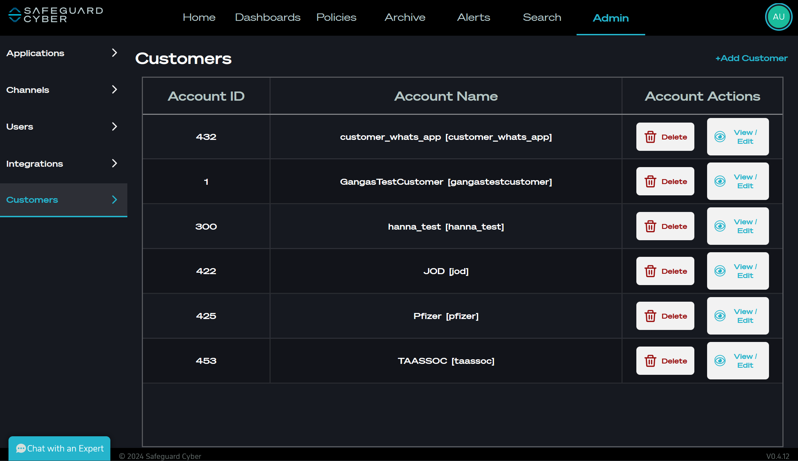

# Admin Page

The Admin Page is where all SGC administration for a user's organization happens. 

## Applications

*Applications Tab in the Admin Page*

The Applications Tab allows users to manage the global settings for the service types their organization has created [Channels](#Channels) for. 

## Channels

*Channels Tab in the Admin Page*

The Channels Tab allows users to add, update, and delete channels for each type of service. 

## Users

*Users Tab in the Admin Page*

The Users Tab allows either a **[SGCSuperAdmin](extra_info/User_Roles.md)** with a customerId, or a **[CustomerAdmin](extra_info/User_Roles.md)**  add, update, remove users from the SGC platform. 

## Integrations

*Integrations Tab in Admin Page*

The Integrations tab is only accessible to **[SGCSuperAdmins](extra_info/User_Roles.md)**. The Integrations tab has global settings that are specific to either the customerId (if they have one), or to the app itself. 

This tab is similar to the Applications tab. The Integrations tab is contains global settings for the user organization. Currently this page is used mainly in demos / poc / SGC global settings. 

## Customers

*Customers Tab in Admin Page*

The Customers tab is only viewable by [SGC Super Admins](extra_info/User_Roles.md). This page is used to Add / Update / Delete any existing customer organizations. The page also allows Admins to View / Edit their specific Users tab so Admin can manage organization users within the UI. 