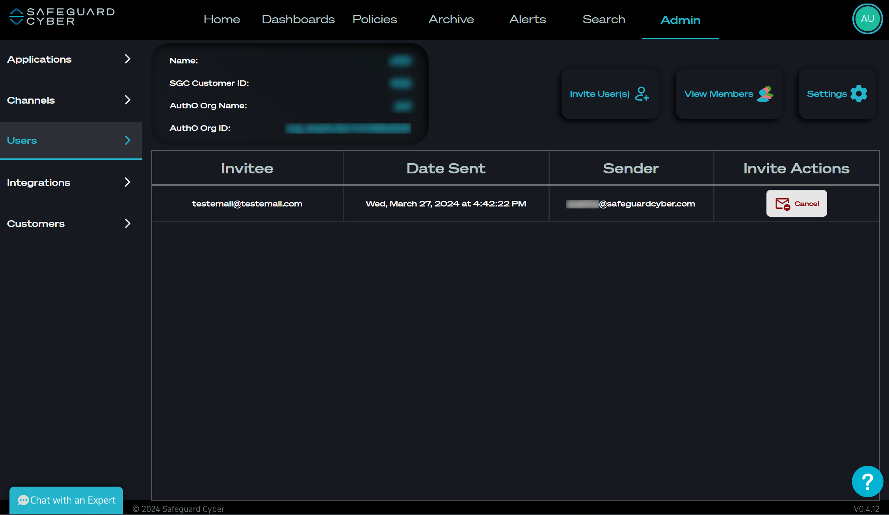
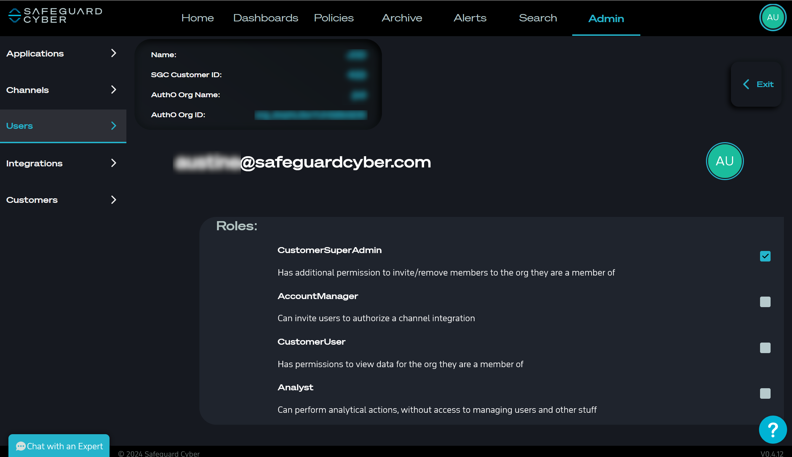

# Admin Page

The Admin Page is where all SGC administration for a user's organization happens. 

---
## Applications

*Applications Tab in the Admin Page*

The Applications Tab allows users to manage the global settings for the service types their organization has created [Channels](#Channels) for. 

---
## Channels

*Channels Tab in the Admin Page*

The Channels Tab allows users to add, update, and delete channels for each type of service. 

### Adding a New Channel 

To add a new channel a user simple needs to navigate to the Channels Tab in the Admin Panel and select the **Add Channel** button in the top right of the page. Then the Add Channel dialog will appear. The user then simple selects the *Channel Type* and give a *Channel Name*. Selecting **Create** will create the channel. 

---
## Users

*Users Tab in the Admin Page*

The Users Tab allows either a **[SGC Super Admin](extra_info/User_Roles.md)** with a customerId, or a **[Customer Admin](extra_info/User_Roles.md)**  add, update, remove users from the SGC platform. 

### Managing Users

#### Invite New Users

After selecting the **Invite User(s)** button, a dialog will appear where the user can add emails to invite to the organization. 

#### View Invitations

The **View Invites** button will show the Invitations screen where the user can view / manage all pending invitations. Here they can view a table breaking down information about pending invitations, as well as, cancel any pending invites. 

#### View / Edit Users

The **View / Edit** screen allows the user to manage the permissions of each user within their organization. 

#### Remove Users 

To remove a user simply select the **Remove User** button next to the user you wish to remove. 

#### Settings 

The settings page allows the user to manage various aspects of their organization and its representation within the SafeGuard Cyber app. 
##### Custom Logo

Sets a custom logo for the user's organization. 

##### Email Settings 

Email settings are needed for the user's organization to send emails from the platform. This allows the user to set their mail host. 

##### Email Templates

Email templates allow the user to manage the emails sent from the SGC8 app. 

##### Create SCIM Settings 

The SCIM settings allows the user's organization link with their SCIM service to the SGC8 platform. To do this, the user will need a SCIM URL and Access Token. This page also allows the user to toggle the SCIM service off and on. 

##### Update Export Settings 

The first step with email export settings allows the user to configure hosting, sender email, etc for email exports of archives. The second step (appears after saving settings from the first), allows the user to switch between each of their currently active channels and add emails to receive the exports for that channel.

##### Adjust Policies

---
## Integrations

*Integrations Tab in Admin Page*

The Integrations tab is only accessible to **[SGC Super Admins](extra_info/User_Roles.md)**. The Integrations tab has global settings that are specific to either the customerId (if they have one), or to the app itself. 

This tab is similar to the Applications tab. The Integrations tab is contains global settings for the user organization. Currently this page is used mainly in demos / poc / SGC global settings. 

### Managing Integrations

---
## Customers

*Customers Tab in Admin Page*

The Customers tab is only viewable by [SGC Super Admins](extra_info/User_Roles.md). This page is used to Add / Update / Delete any existing customer organizations. The page also allows Admins to View / Edit their specific Users tab so Admin can manage organization users within the UI. 

### Managing Customers 

#### Add Customers

To add a new customer click the **Add Customer** button in the top right corner of the Customers tab. Then give the new customer a name and click the **Create** button to add the customer. 

#### View / Edit Customers

After selected the **View / Edit** button the user will be navigated to a screen where they can manage the users in the Customer group. 

#### Remove Customers 

To remove a user simply select the **Delete** button next to the customer you wish to remove. 