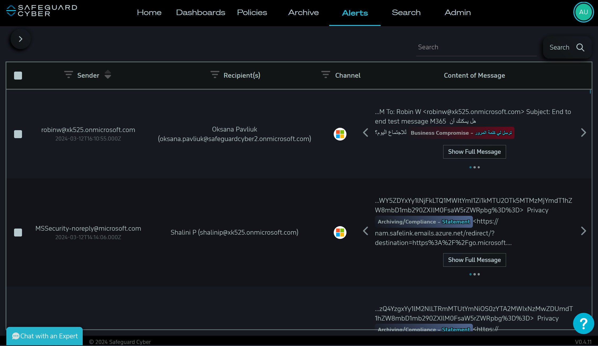
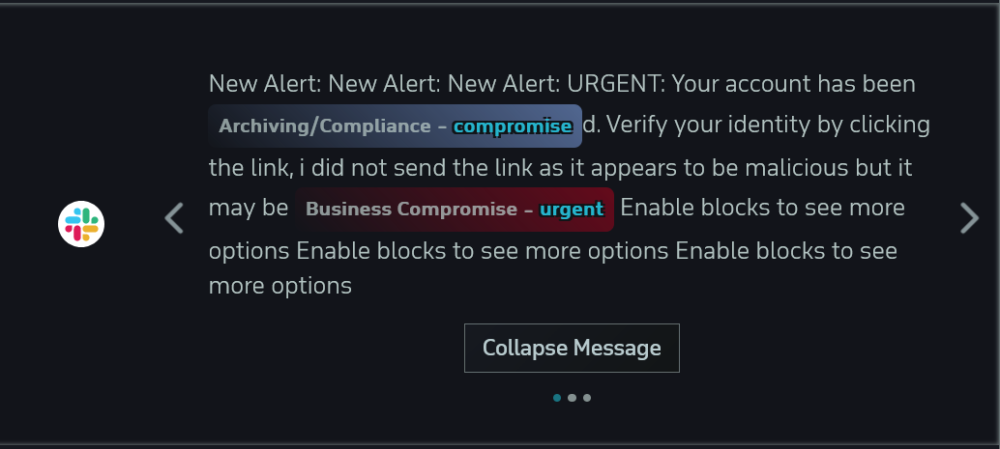
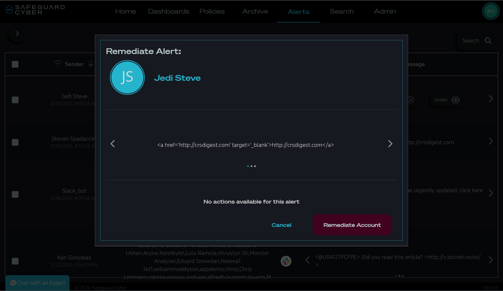

# Alerts Page 

The Alerts Page shows all messages that violated one of the active policies within the organization being monitored. 

## Alerts Table

`Sender` - Shows the user the Sender of each message

`Recipients` - Shows the user the Recipient of each message

`Channel` - Shows the user the Channel each message was sent in

`Content of Message` - Shows the reader the message sent

## UI

### Alert Message Content

*Alerts Message with Highlighted Message Content*

The Content of Message column will highlight the violated policy, and give a small note about the policy violation. [[Policies Page]]. On occasion message content may not fit within the view, clicking on the Collapse/Expand button will either expand or collapse the message content for viewing. 

*Alert Message Example 2*

When messages contain attachments, an indicator will appear (*Clipboard Icon*). Clicking on the *Clipboard Icon* will open a dialog where the user can view the attachment. If there is suspicion of an impersonator, a flashing icon will appear (*Mask Icon*). 

*Alert Message Example 3*

Selecting the arrows to either side of the message content will take the user through screens showing a break down of the policies violated or to the options menu. Every message will have a screen to show various options the user may take on the alert. 

**Export** - This option will export the message and details into a csv

**Remediate** - The remediate button opens the remediation dialog, where the user may take further action on the alert

**Details** - The details will open a detailed view of the message content

### Remediation

*Remediation Dialog*
