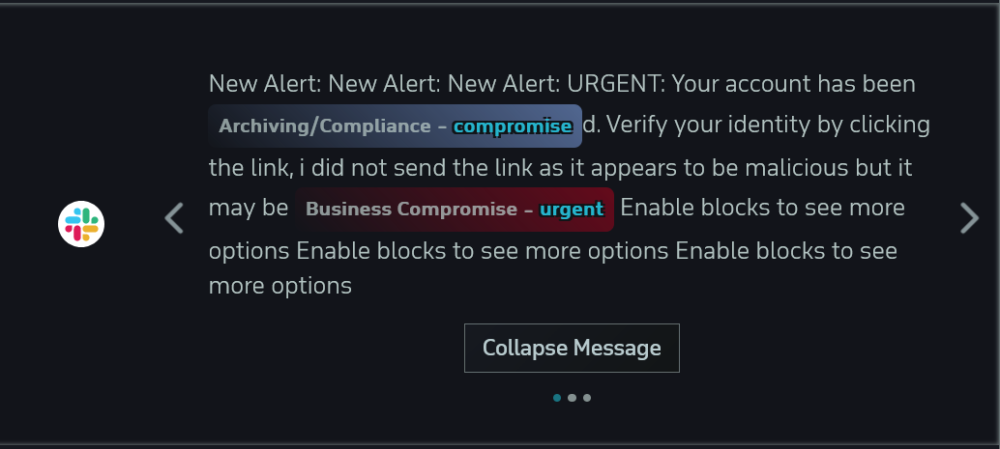

# Alerts Page 

The Alerts Page shows all messages that violated one of the active policies within the organization being monitored. 

## Alerts Table

`Sender` - Shows the user the Sender of each message

`Recipients` - Shows the user the Recipient of each message

`Channel` - Shows the user the Channel each message was sent in

`Content of Message` - Shows the reader the message sent

## UI

### Alert Message

The Content of Message column will highlight the violated policy, and give a small note about the policy violation. [[Policies Page]]
