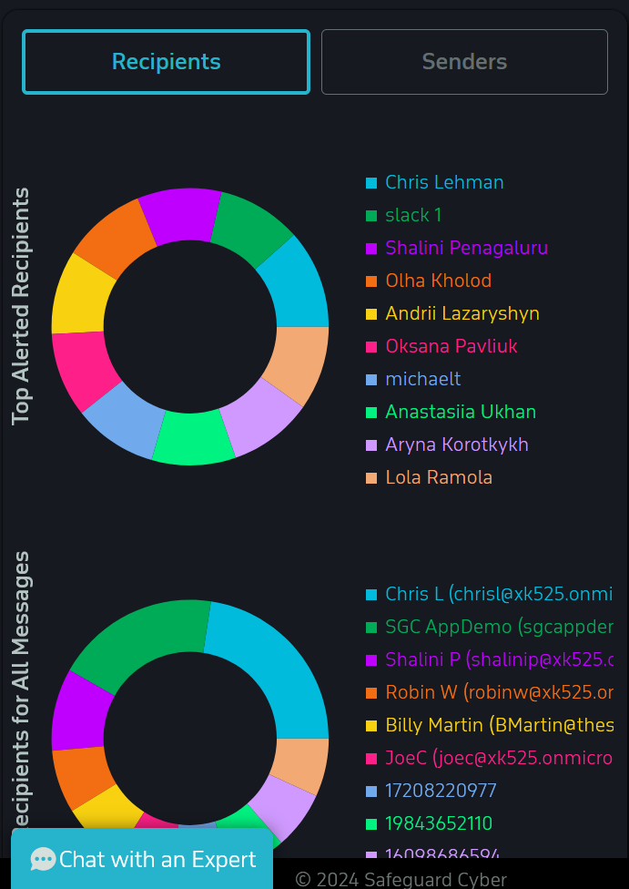
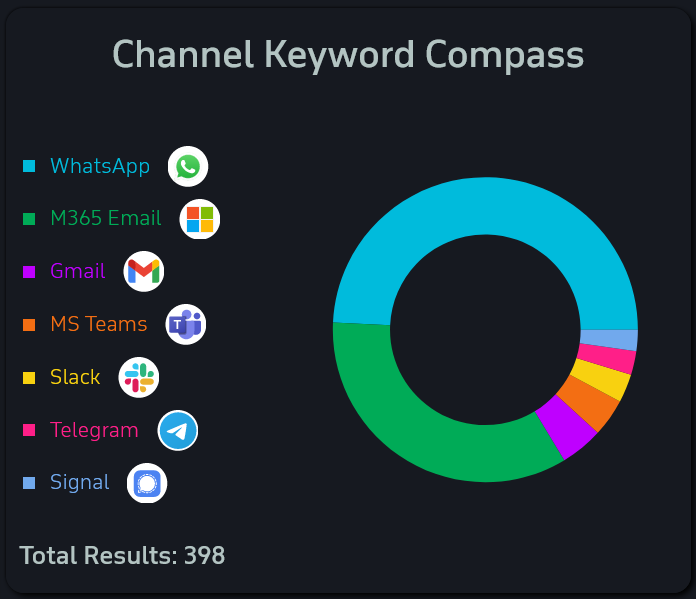
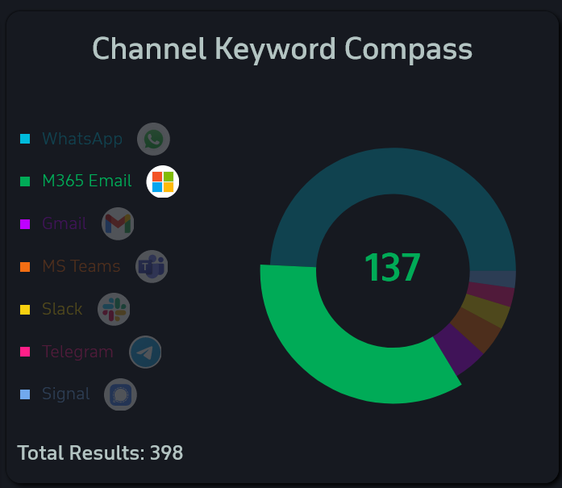

# Dashboards Page

The Dashboards page is where custom dashboard widgets are able to created, managed, and viewed. Currently, there are two default dashboard widgets available. 

## Default Widgets

### Alerts and Messages Widget

*Alerts and Messages - Top Senders / Recipients*

The Alerts and Messages widget allows the user to quickly view the top recipients and top senders of messages. The default shows the top recipients, and the toggle at the top of the widget switches between the two. 

### Channel Keyword Compass 

*Channel Keyword Compass dashboard widget*

*Channel Keyword Compass dashboard widget hovered*

The Channel Keyword Compass shows the count of messages categorized by the channel they originate from. Hovering over any category will show the count of messages found in that category. 