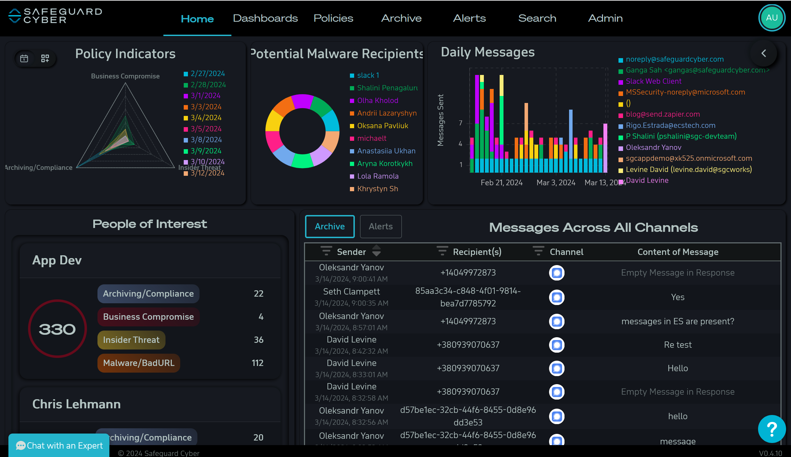
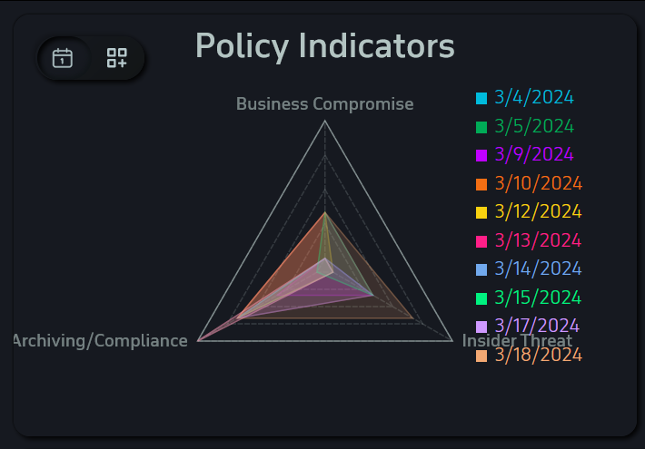
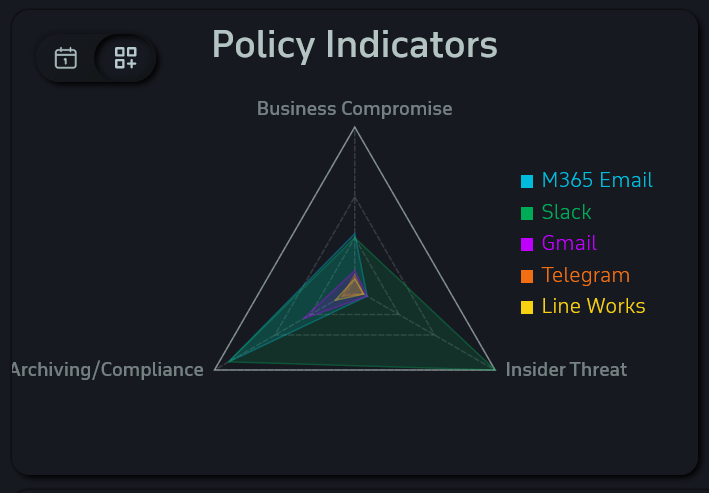
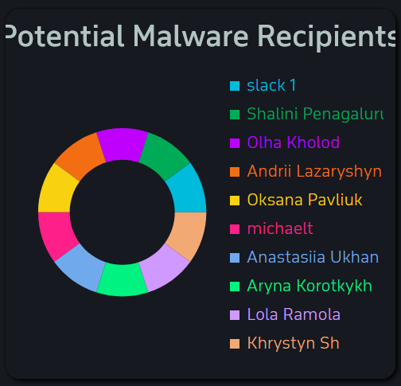
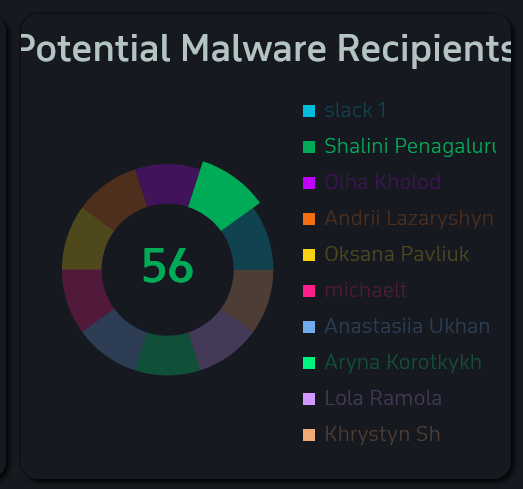
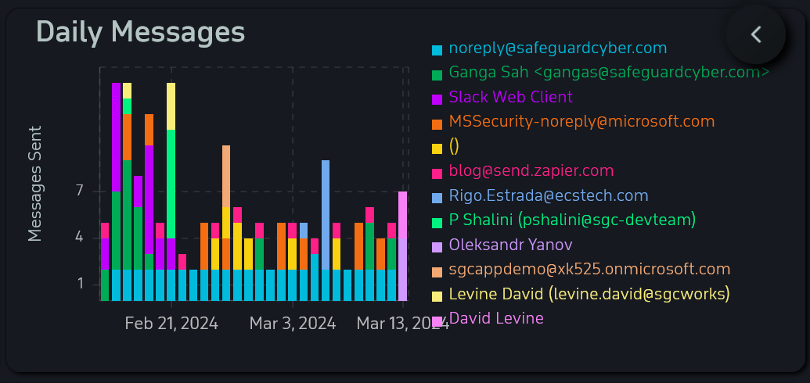
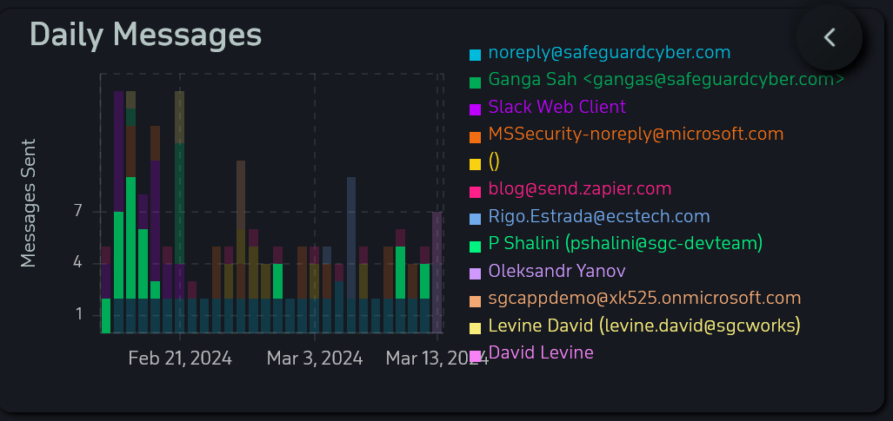
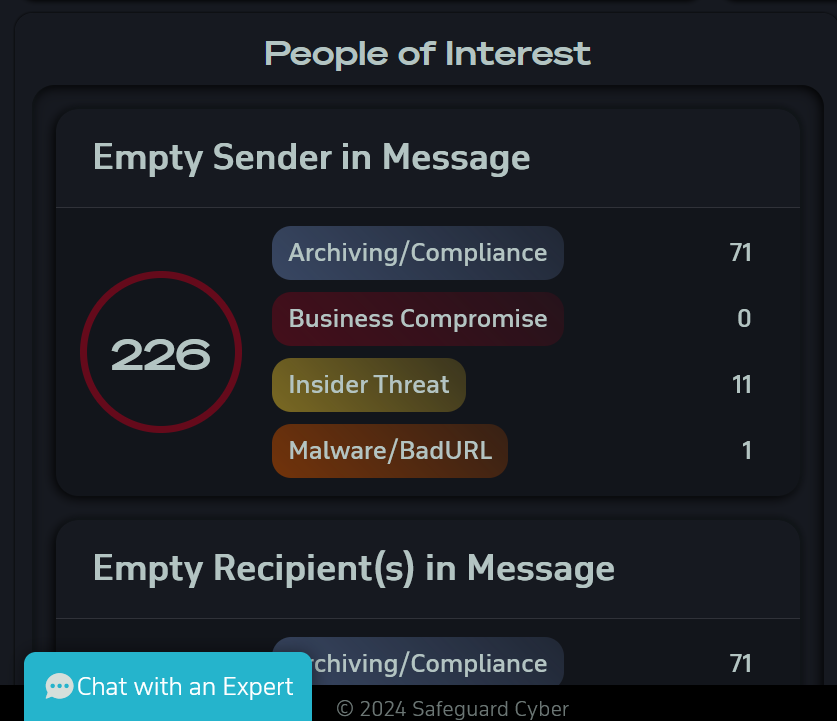
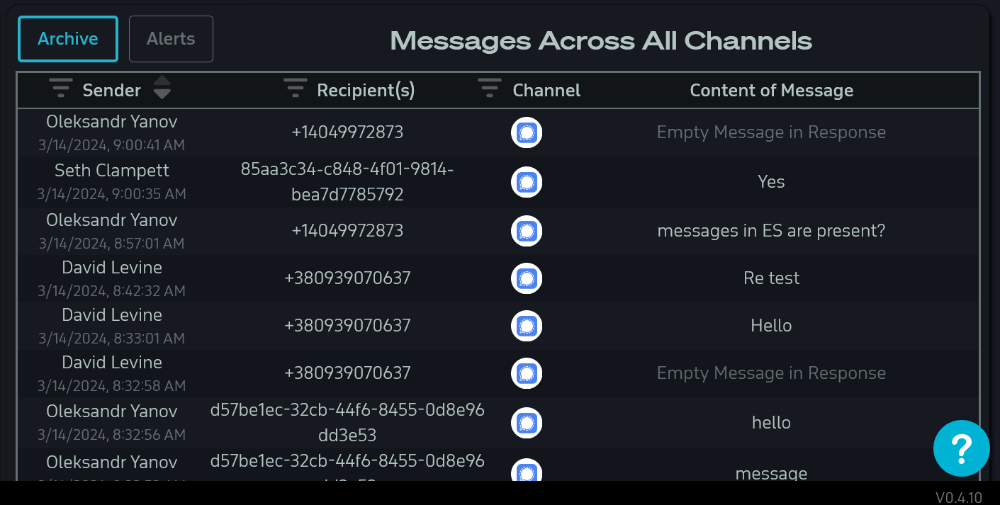

# Home Page
## UI

The Safeguard Cyber home page gives the user an overview of all potential threats being monitored within their organization. This page give detailed graphs of set policy indicators, potential malware recipients, people of interest, recent messages and alerts, and shows current activity within the organization.

### Policy Indicators 

The policy indicators widget shows a graph of potential threats marked by the active policies within the organization. In the top left corner of the policy indicators widget you can show indicators by date or by channel.

*Policy Indicators filtered by Date*

*Policy Indicators filtered by Channel*

### Potential Malware Recipients

The Potential Malware Recipients widget shows organization users that may have recently received a malware threat. Hovering over a name, will show the number of threats the organization user may have received. Clicking on a hovered name will navigate the user to the [[Alerts Page]] where they can explore the potential threat further. 

*Potential Malware Recipients Widget*

*Potential Malware Recipients with an organization user hovered*

### Daily Messages

The Daily Messages widget shows message sent by organization users. Hovering over a name highlights the organization user's messages on the graph. Selecting the organization user's name will navigate the user to the [[Archive Page]] where they can explore the data deeper. 

*Daily Messages Widget*

*Daily Messages widget with an organization user hovered*

### People of Interest

The People of Interest widget highlights organization users that are not in compliance with the organizations tracked policies. This widget shows shows each user and the count of each policy that they are in non-compliance of. Selecting one of the policies will navigate the user to the [[Alerts Page]] where they can view the potential threats in greater detail. 

*People of Interest Widget*

### Channel Messages

The Channel Messages widget shows messages from all channels. This gives the user a fast way of viewing the most recent messages withing their organization. 

*Channel Messages Widget*